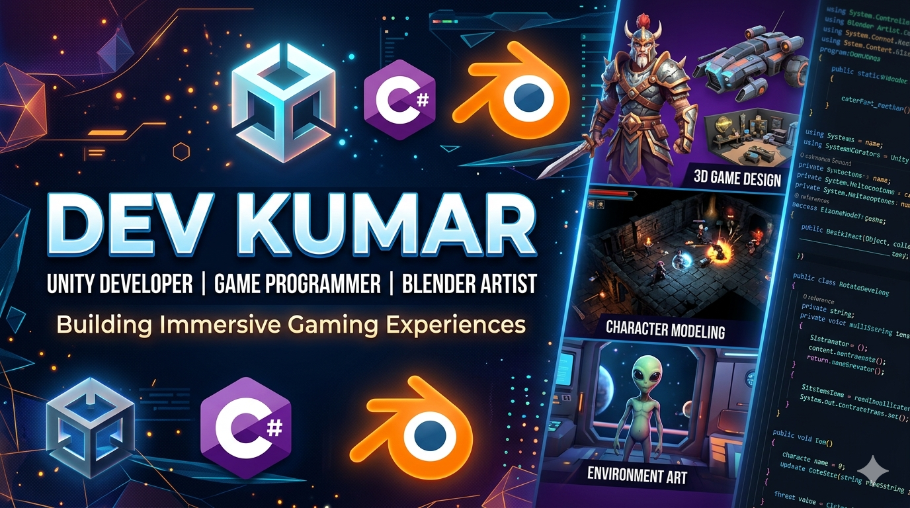
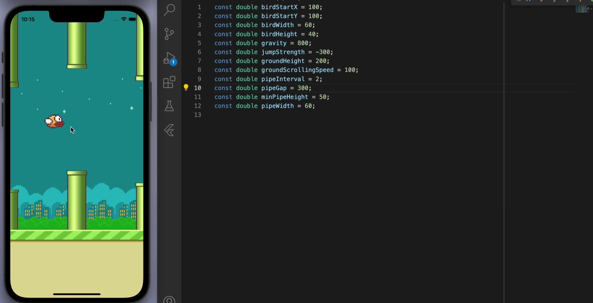
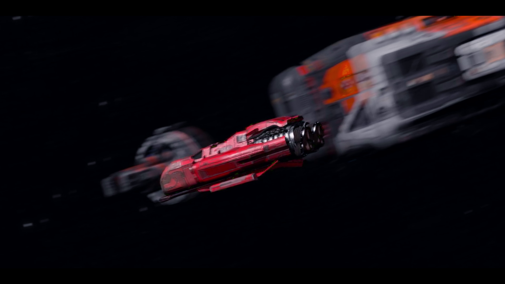

# 👋 Hi, I'm Dev Kumar

  

## 🎮 About Me

Computer Science student and aspiring Game Developer with experience in:

- Unity 3D
- C#
- Game Programming
- Blender
- Flutter Flame Engine
- OOP and DSA
- Git and GitHub

---

## 🛠️ Tech Stack

Unity 3D • C# • Blender • Git • GitHub • Flutter • Flame Engine

---

## 🎯 Featured Projects

### 👻 Horror Survival Game
A first-person horror survival game built using Unity 3D and C#.

Features:
- Enemy AI
- Atmospheric Lighting
- Survival Mechanics
- Interactive Environment
- Sound Effects

Repo Link: https://github.com/devverma4572/Horror-Game

📸 Screenshot:

 

 

 

---

### 🐦 Flappy Bird Clone
A 2D arcade game developed using Flutter and Flame Engine.

Features:
- Collision Detection
- Sprite Animation
- Score Tracking
- Responsive Controls

Repo Link: https://github.com/devverma4572/Flappy-Bird-Game

📸 Screenshot:

---

### 🌌 Space Scene in Blender

Features:
- 3D Modeling
- Lighting
- Animation
- Camera Movement

Video Link: https://shorturl.at/Pa4c7

 
 

---

## 📫 Connect With Me

LinkedIn: https://linkedin.com/in/kumardevvv

GitHub: https://github.com/devverma5472

Email: kumardev4357@gmail.com
